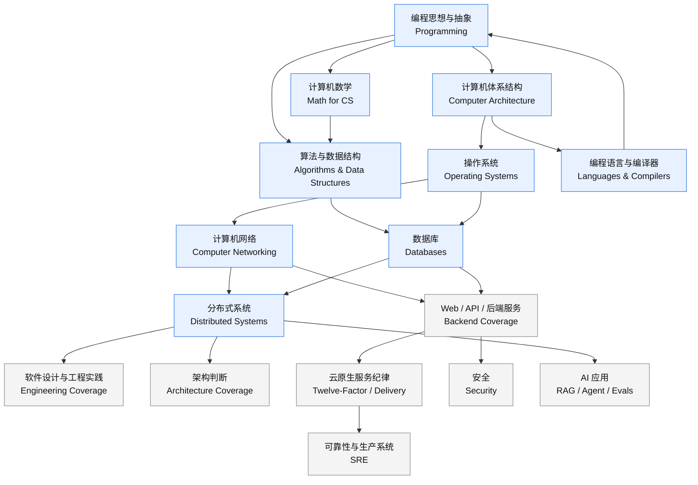
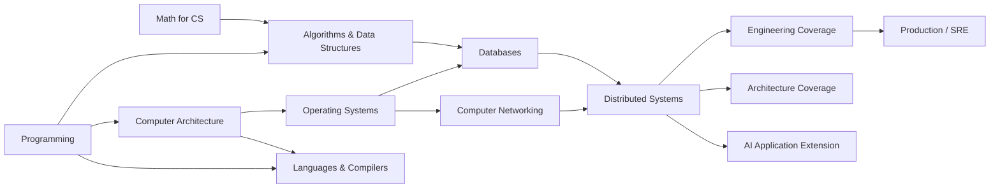

# 计算机全局骨架图谱

日期：2026-07-09  
作者：Codex  
状态：候选骨架草案，等待人工决策后固化

## 0. 文档定位

这份文档不是学习计划、课程排期或项目实施方案，而是一个“程序员 / 架构师视角”的计算机世界坐标系。

核心用途：

- 看清一个知识点属于计算机世界的哪个位置。
- 区分理论主干、现代工程覆盖层、专业延伸和工具节点。
- 避免把 `Python`、`FastAPI`、`SQLite`、`HTTP`、`Docker`、`RAG`、`Agent` 混成同一层级。
- 把有争议的骨架选择显式放到台面上，由人工裁决后再固化。

本图谱的第一事实源是 [Teach Yourself CS](https://teachyourselfcs.com/)。它提供的是经典计算机科学主干和高价值书单。  
[roadmap.sh Computer Science](https://roadmap.sh/computer-science) 与 [roadmap.sh Backend](https://roadmap.sh/backend) 只用于交叉验证现代工程覆盖面，不直接反推理论主干。

## 1. 总图

读图方式：

- 蓝色主干来自 TYCS，代表计算机科学基础骨架。
- 灰色覆盖层来自 roadmap.sh 和细分工程资源，代表现代软件工程、后端、架构、SRE、安全、AI 应用的落点。
- 工具、框架和产品不直接进入主干，只挂在对应节点下面。

## 2. TYCS 主干

### 2.1 编程思想与抽象

| 项目 | 内容 |
| --- | --- |
| 英文节点 | Programming |
| 核心资源 | [SICP](https://mitpress.mit.edu/9780262510875/structure-and-interpretation-of-computer-programs/)、CS61A、Composing Programs、HtDP |
| 解决什么问题 | 程序如何表达思想，如何用抽象、组合、递归和解释过程压缩复杂度。 |
| 上游 | 基础编程经验。 |
| 下游 | 算法、编程语言、软件设计、系统设计。 |
| 主干判断 | 理论主干。 |

高净值思想：

- 抽象是程序员管理复杂度的第一工具。
- 递归、高阶过程、组合会改变看问题的方式。
- 解释器视角能让“语言”从固定工具变成可理解、可构造的系统。
- 学一门具体语言的价值低于理解“语言如何表达计算”。

### 2.2 计算机体系结构

| 项目 | 内容 |
| --- | --- |
| 英文节点 | Computer Architecture |
| 核心资源 | [CSAPP](https://csapp.cs.cmu.edu/)、[Nand2Tetris](https://www.nand2tetris.org/)、Berkeley CS61C、Patterson & Hennessy |
| 解决什么问题 | 软件如何落到机器：数据表示、指令、内存、缓存、链接、系统调用和性能边界。 |
| 上游 | 编程思想与基础代码经验。 |
| 下游 | 操作系统、数据库、编译器、性能工程、系统调试。 |
| 主干判断 | 理论主干。 |

高净值思想：

- 程序性能不是魔法，受数据表示、缓存、内存层级、链接和系统调用影响。
- CSAPP 是从代码到真实机器的桥。
- Nand2Tetris 提供从门电路到软件栈的纵向直觉，但会牺牲现代架构深度。
- 架构知识的目标不是成为硬件工程师，而是让程序员知道软件在什么物理和系统约束下运行。

### 2.3 算法与数据结构

| 项目 | 内容 |
| --- | --- |
| 英文节点 | Algorithms and Data Structures |
| 核心资源 | The Algorithm Design Manual、Skiena lectures、Roughgarden algorithms、How to Solve It、LeetCode 作为练习库 |
| 解决什么问题 | 把现实问题转成结构化问题，并用复杂度语言判断方案成本。 |
| 上游 | 编程思想；离散数学可并行补。 |
| 下游 | 数据库查询、网络路由、编译器、搜索、推荐、AI/ML、系统性能。 |
| 主干判断 | 理论主干；练习题属于血肉，不是骨架本身。 |

高净值思想：

- 算法核心不是背题，而是问题建模。
- 复杂度是程序员讨论规模、性能和取舍的通用语言。
- 图、搜索、排序、哈希、递归、贪心、动态规划是跨领域模板。
- 刷题平台只验证熟练度，不能替代算法设计思想。

### 2.4 计算机数学

| 项目 | 内容 |
| --- | --- |
| 英文节点 | Mathematics for Computer Science |
| 核心资源 | Lovasz notes、MIT Mathematics for Computer Science / 6.042J、Essence of Linear Algebra、Strang Linear Algebra |
| 解决什么问题 | 用证明、集合、逻辑、计数、概率、图和线性空间解释计算结构。 |
| 上游 | 基础代数。 |
| 下游 | 算法正确性、复杂度、密码学、图形学、机器学习、形式化方法。 |
| 主干判断 | 理论主干。 |

高净值思想：

- 证明训练“为什么正确”，不是只训练算题。
- 组合与概率解释规模、不确定性和随机系统。
- 图论连接算法、网络、数据库关系、分布式系统和知识图谱。
- 线性代数是图形学和机器学习的重要底座，但不是所有程序员都要同等深入。

### 2.5 操作系统

| 项目 | 内容 |
| --- | --- |
| 英文节点 | Operating Systems |
| 核心资源 | [OSTEP](https://pages.cs.wisc.edu/~remzi/OSTEP/)、Berkeley CS162、xv6、Linux Kernel Development、OS internals books |
| 解决什么问题 | 单机资源管理：进程、线程、内存、并发、文件、I/O、持久化和内核接口。 |
| 上游 | 计算机体系结构。 |
| 下游 | 数据库、网络服务器、分布式系统、安全、性能排障。 |
| 主干判断 | 理论主干。 |

高净值思想：

- OS 用虚拟化把有限硬件包装成可管理抽象。
- 并发首先是正确性问题，不是语法问题。
- 持久化把故障、恢复和数据一致性引入系统设计。
- 进程、线程、锁、文件、内存不是孤立概念，它们会同时出现在数据库、Web 服务和分布式系统里。

### 2.6 计算机网络

| 项目 | 内容 |
| --- | --- |
| 英文节点 | Computer Networking |
| 核心资源 | [Computer Networking: A Top-Down Approach](https://gaia.cs.umass.edu/kurose_ross/)、Wireshark labs、Stanford CS144 |
| 解决什么问题 | 多台机器如何通信：分层协议、可靠传输、拥塞、路由、DNS、HTTP、TLS。 |
| 上游 | 操作系统；少量概率和性能直觉。 |
| 下游 | Web、API、分布式系统、云服务、系统排障、安全。 |
| 主干判断 | 理论主干。 |

高净值思想：

- 分层把端到端通信拆成可替换协议。
- 可靠性经常是在不可靠底层上构造出来的。
- 抓包能把抽象协议落回事实。
- Web 工程里的很多“玄学问题”本质是网络、协议和缓存问题。

### 2.7 数据库

| 项目 | 内容 |
| --- | --- |
| 英文节点 | Databases |
| 核心资源 | Berkeley CS186、Architecture of a Database System、Readings in Database Systems、Database Management Systems、Data and Reality |
| 解决什么问题 | 持久数据如何建模、查询、索引、事务、恢复、并发控制和优化。 |
| 上游 | 操作系统、计算机体系结构、算法。 |
| 下游 | 后端服务、数据系统、分布式事务、RAG 数据层、业务正确性。 |
| 主干判断 | 理论主干。 |

高净值思想：

- DBMS 是操作系统、算法、并发控制和存储结构的综合体。
- 查询优化是成本模型驱动的搜索问题。
- 事务是业务正确性和系统故障之间的契约。
- 数据建模决定系统能否长期表达真实业务，而不只是能否 CRUD。

### 2.8 编程语言与编译器

| 项目 | 内容 |
| --- | --- |
| 英文节点 | Languages and Compilers |
| 核心资源 | [Crafting Interpreters](https://craftinginterpreters.com/)、Dragon Book、Alex Aiken Compilers |
| 解决什么问题 | 语言如何表达、约束、翻译、优化和执行程序。 |
| 上游 | 编程思想、计算机体系结构、算法。 |
| 下游 | 工具链、DSL、静态分析、运行时、类型系统、开发者工具。 |
| 主干判断 | 理论主干；roadmap.sh 覆盖不足。 |

高净值思想：

- 程序员学语言，计算机科学学“语言本身”。
- 解释器和编译器是“程序理解程序”的核心范式。
- 类型、作用域、闭包、字节码、GC、运行时是长期高价值概念。
- DSL、代码生成、静态分析、AI coding 工具都依赖语言与编译器思想。

### 2.9 分布式系统

| 项目 | 内容 |
| --- | --- |
| 英文节点 | Distributed Systems |
| 核心资源 | [DDIA](https://dataintensive.net/)、Distributed Systems 3e、MIT 6.824 / 6.5840、经典论文 |
| 解决什么问题 | 多机环境下如何面对故障、复制、一致性、分区、扩展、延迟和吞吐权衡。 |
| 上游 | 操作系统、计算机网络、数据库。 |
| 下游 | 云服务、数据平台、微服务、可靠系统、AI 应用后端。 |
| 主干判断 | 理论主干。 |

高净值思想：

- 故障是常态，不是异常。
- 一致性、可用性、延迟、吞吐、成本永远是权衡。
- 分布式系统不能只看概念，需要读真实案例和论文。
- 现代后端、数据平台和 AI 应用都会继承分布式系统的限制。

## 3. roadmap.sh 交叉验证

### 3.1 一致、补充与冲突矩阵

| TYCS 节点 | roadmap.sh 对应节点 | 判断 |
| --- | --- | --- |
| Programming | Pick a Language | 一致但层级不同。TYCS 重编程思想，roadmap.sh 偏语言选择清单。 |
| Computer Architecture | How Computers Work、CPU、Registers、RAM、CPU Cache、Floating Point、Endianess、Bitwise Operators | 一致 / 补充。roadmap.sh 覆盖关键名词，但不如 TYCS 系统。 |
| Algorithms and Data Structures | Data Structures、Asymptotic Notation、Common Algorithms、String Search、Balanced Trees、Trie、K-D Tree、Skip List、Complexity Classes、NP Complete | 高度一致。roadmap.sh 更偏清单和面试题型，TYCS 更偏算法设计能力。 |
| Math for CS | Basic Math Skills、Probability、Combinatorics、P/NP/NP-hard | 部分一致。roadmap.sh 数学覆盖偏窄，缺证明、逻辑、图论的系统训练。 |
| Operating Systems | Processes and Threads、Memory Management、Mutex、Semaphore、Scheduling、Interrupts | 部分一致。roadmap.sh 抓住进程线程和并发，但缺文件系统、虚拟内存、I/O、内核接口等主干。 |
| Computer Networking | OSI、TCP/IP、DNS、HTTP、TLS/HTTPS、Sockets；Backend 的 Internet、Browser、Hosting、HTTP、DNS | 一致。Backend 补充 Web 开发视角，但不能替代网络理论。 |
| Databases | SQL vs NoSQL、Normalization、ER Model、ACID、BASE、CAP、PACELC、Indexes、Transactions、Replication、Sharding | 高度一致。Backend 补充 ORM、N+1、migration、scaling DB 等工程操作点。 |
| Languages and Compilers | Pick a Language、Character Encodings | 覆盖不足。TYCS 的 PL / 编译器理论在 roadmap.sh CS / Backend 中基本缺位。 |
| Distributed Systems | System Design、CAP、Queues、Load Balancing、Clustering、Caching、CDN、Proxy、Message Brokers、Microservices、Service Mesh、Real-Time Data、Building for Scale | 一致 / 强补充。roadmap.sh 更像现代分布式应用工程入口，TYCS 更偏理论根基。 |
| Security | Public Key Cryptography、Hashing、Encryption、OWASP Top 10、Authentication、JWT、OAuth、SAML、CORS、CSP | TYCS 未单列。建议作为横向覆盖层，暂不提升为 TYCS 同级主干。 |
| Software Design / Architecture | UML、Design Patterns、DDD、CQRS、Event Sourcing、TDD、Monolith、Serverless、Microservices、SOA、Twelve-Factor | roadmap.sh 补充职业工程层。应归入“软件设计 / 工程实践”，不是 CS 理论主干。 |
| DevOps / Delivery | Git、Repo Hosting、Testing、CI/CD、Containerization、Docker、Kubernetes、Observability、Monitoring、Telemetry、Web Servers | TYCS 基本不覆盖。重要但属于现代工程覆盖层或工具节点。 |
| API / Web Backend | REST、GraphQL、gRPC、OpenAPI、JSON API、HATEOAS、WebSockets、SSE | TYCS 不直接覆盖。属于后端职业技能和应用协议实践。 |

### 3.2 roadmap.sh 的使用边界

roadmap.sh 的价值：

- 提醒现代工程缺口，例如 API、测试、CI/CD、安全、可观测性、容器化、消息队列。
- 帮助把具体技术放到职业路径和工程场景里。
- 适合作为技能雷达和覆盖检查表。

roadmap.sh 的限制：

- 它会把理论概念、工具、产品、实践模式放在同一张图里。
- Backend 路线天然偏职业技能，不等于计算机科学主干。
- Docker、Kubernetes、Kafka、Redis、Nginx、GitHub 等是工具或平台，不应升级为“计算机全局骨架”。

## 4. 现代工程覆盖层

| 覆盖层 | 代表资源 | 归位 | 是否主干 |
| --- | --- | --- | --- |
| 软件设计与工程实践 | A Philosophy of Software Design、Software Engineering at Google、Google Engineering Practices | 管理代码复杂度、模块边界、长期维护、测试、代码评审。 | 工程覆盖层，强相关 |
| Web / API / 后端服务 | MDN HTTP、REST、GraphQL、gRPC、OpenAPI、FastAPI 类框架 | 网络和分布式系统在业务服务中的应用层。 | 工程覆盖层 |
| 架构判断 | Martin Fowler Architecture Guide、AOSA | 判断哪些技术决策重要、难改、影响系统长期演化。 | 工程覆盖层，强相关 |
| 云原生服务纪律 | Twelve-Factor App | 配置、依赖、日志、进程、环境可移植性。 | 工程覆盖层 |
| 可靠性与生产系统 | Google SRE Books | SLO、监控、告警、事故响应、自动化、错误预算。 | 工程覆盖层，强相关 |
| 安全 | roadmap.sh Web Security、OWASP、Auth、TLS、CORS、CSP | 横切所有网络、后端和数据系统。 | 横向覆盖层，待决策是否升为一级 |
| AI 应用 | LLM API、Embedding、RAG、Agent、Evals | 建在数据、网络、后端、分布式和可靠性之上的专业延伸。 | 专业延伸，需另开 AI 资源验证 |

## 5. 技术词定位表

| 技术词 | 归类 | 所属节点 | 说明 |
| --- | --- | --- | --- |
| Python | 工具 / 语言实例 | 编程思想与抽象；编程语言与编译器 | 它是表达计算的具体语言，不是骨架本身。 |
| FastAPI | 工具 / 框架 | Web / API / 后端服务 | 属于后端服务实现工具，依赖 HTTP、API、Python、数据系统。 |
| SQLite | 工具 / 数据库产品 | 数据库 | 用来理解关系模型、SQL、索引、事务、持久化的轻量入口。 |
| HTTP | 主干概念 + 工程协议 | 计算机网络；Web / API / 后端服务 | 是网络应用层协议，也是 Web 后端的基础。 |
| Docker | 工具 / 交付平台 | 云原生服务纪律；DevOps / Delivery | 是环境封装和部署工具，不是理论主干。 |
| Kubernetes | 平台 / 工具生态 | 云原生服务纪律；可靠性与生产系统 | 是容器编排平台，暂不进入基础骨架主干。 |
| Redis | 工具 / 数据系统产品 | 数据库；缓存；分布式系统 | 可用来理解缓存、内存数据结构、过期、持久化和分布式权衡。 |
| Kafka | 工具 / 消息系统 | 分布式系统；后端服务 | 是消息日志和事件流平台，不是主干本身。 |
| RAG | 专业延伸 | AI 应用；数据库；搜索；后端服务 | 建在文档处理、Embedding、检索、数据库、LLM API 之上。 |
| Agent | 专业延伸 | AI 应用；编程抽象；后端服务；可靠性 | 涉及任务分解、工具调用、状态、评估和人工兜底。 |
| Evals | 专业延伸 / 工程实践 | AI 应用；软件工程；可靠性 | AI 系统质量控制，不等同于传统单元测试。 |

## 6. 争议台账

### 争议：是否把 SICP 作为编程思想主入口

- 选项 A：保留 SICP 作为主入口。
- 选项 B：改用 Composing Programs 或 HtDP 作为主入口。
- 来源差异：TYCS 明确推荐 SICP；现代 Python 学习者可能更容易从 Composing Programs 进入。
- 支持 A 的证据：SICP 强在抽象、解释器、递归和计算心智模型，适合建立高视野。
- 支持 B 的证据：Composing Programs 更贴近 Python，进入成本低；HtDP 教学结构更友好。
- 我的推荐：主骨架仍保留 SICP；实际入口可标注 Composing Programs / HtDP 作为替代。
- 置信度：中。
- 需要你决策：最终图谱里是否把 SICP 写成唯一主入口，还是写成“主入口 + 替代入口”。

### 争议：Computer Architecture 主资源优先 CSAPP 还是 Nand2Tetris

- 选项 A：CSAPP 作为主资源。
- 选项 B：Nand2Tetris 作为主资源。
- 来源差异：TYCS 同时推荐 CSAPP 和 Nand2Tetris，但指出 Nand2Tetris 深度上会牺牲现代架构内容。
- 支持 A 的证据：CSAPP 更贴近程序员理解真实程序运行、内存、链接、系统调用和性能。
- 支持 B 的证据：Nand2Tetris 能形成从门电路到应用程序的纵向全栈直觉。
- 我的推荐：工程主索引用 CSAPP；Nand2Tetris 放为“纵切补充资源”。
- 置信度：高。
- 需要你决策：是否接受“CSAPP 主、Nand2Tetris 辅”的定位。

### 争议：算法主资源用 Skiena / Roughgarden，还是 CLRS

- 选项 A：The Algorithm Design Manual / Roughgarden 作为主资源。
- 选项 B：CLRS 作为主资源。
- 来源差异：TYCS 偏向 Skiena，认为 CLRS 和 Sedgewick 对实践型学习者可能偏证明或教材化。
- 支持 A 的证据：Skiena 更强调算法设计和问题建模，适合作为骨架入口。
- 支持 B 的证据：CLRS 覆盖完整、严谨，是经典参考书。
- 我的推荐：主骨架用 Skiena / Roughgarden；CLRS 标为参考书，不作为第一入口。
- 置信度：中高。
- 需要你决策：算法节点是否突出“问题建模”，而不是“经典大部头完整性”。

### 争议：是否把 AI/ML 放入一级主干

- 选项 A：AI/ML 进入一级主干。
- 选项 B：AI/ML 作为专业延伸。
- 来源差异：TYCS FAQ 把 AI、ML、Graphics 放入 elective；用户目标又明确处于 AI 时代。
- 支持 A 的证据：当前个人目标涉及 RAG、Agent、AI 产品，AI 应用非常重要。
- 支持 B 的证据：计算机全局骨架先要解释计算、系统、网络、数据、分布式；AI 应用建立在这些之上。
- 我的推荐：本图谱 v1 把 AI 应用放为专业延伸；另开 AI 骨架资源验证后再决定是否升级一级。
- 置信度：中。
- 需要你决策：这个图谱是否要遵循 TYCS 的经典 CS 边界，还是面向个人目标把 AI 应用提前升为一级。

### 争议：Software Engineering / Architecture 是否进入一级主干

- 选项 A：进入一级主干。
- 选项 B：作为现代工程覆盖层。
- 来源差异：TYCS 主打 CS foundations，基本不覆盖软件工程管理、代码评审、架构治理；roadmap.sh 和细分资源强烈覆盖这些内容。
- 支持 A 的证据：程序员和架构师视角离不开软件设计、工程实践、长期维护和架构决策。
- 支持 B 的证据：软件工程不是 TYCS 九大理论主干之一，直接升一级会混淆 CS 主干和职业实践。
- 我的推荐：作为现代工程覆盖层，且标为强相关。
- 置信度：中。
- 需要你决策：是否允许图谱采用“双层结构”：CS 主干 + 工程覆盖层。

### 争议：Security 是否单列一级主干

- 选项 A：Security 单列一级主干。
- 选项 B：Security 作为横向关注点。
- 来源差异：TYCS 未单列安全；roadmap.sh CS / Backend 都强调 OWASP、Auth、TLS、加密、CORS、CSP 等。
- 支持 A 的证据：现代 Web、后端、数据和 AI 系统都无法绕开安全。
- 支持 B 的证据：安全横跨网络、系统、密码学、应用、权限和运维，单列一级容易变成过大主题。
- 我的推荐：v1 作为横向覆盖层，后续如有安全专项再拆一级图谱。
- 置信度：中高。
- 需要你决策：是否把安全升级为和数据库、网络、OS 同级的一级节点。

### 争议：Docker / Kubernetes / Kafka / Redis 等工具是否只作为技能雷达

- 选项 A：只作为技能雷达或工具节点。
- 选项 B：提升为骨架节点。
- 来源差异：roadmap.sh Backend 把这些工具列得很突出；TYCS 不把具体工具当主干。
- 支持 A 的证据：工具会变，底层概念更稳定；Docker 属于部署封装，Kafka 属于消息/日志系统，Redis 属于数据系统产品。
- 支持 B 的证据：现代工程实践中这些工具非常常见，直接影响工作能力。
- 我的推荐：只作为技能雷达，挂到对应骨架节点下面。
- 置信度：高。
- 需要你决策：图谱是否严格避免把具体产品升级为一级骨架。

### 争议：DDIA 是否使用 2e 作为优先版本

- 选项 A：优先使用 DDIA 2e。
- 选项 B：保留 TYCS 原始 DDIA 推荐，不指定版本。
- 来源差异：子代理研究指出 2026 已看到 2e 信息；本地复核 `dataintensive.net` 首页未直接证明 2e，因此不能在本文里把 2e 当成已核准事实。
- 支持 A 的证据：如果官方出版页确认 2e 已发布或可用，新版通常能覆盖更多现代数据系统内容。
- 支持 B 的证据：TYCS 原始推荐关系只需要 DDIA 作为分布式和数据系统骨架书，不依赖版本裁决。
- 我的推荐：本文暂写 DDIA，不指定版本；待官方出版页确认后再标注版本。
- 置信度：中。
- 需要你决策：是否后续单独核查并指定 DDIA 版本。

## 7. 待决策后的最终候选骨架

当前不固化最终骨架，只给待决策候选：

人工决策后需要固化的点：

- 编程入口：SICP 唯一主入口，还是 SICP + 替代入口。
- 体系结构入口：CSAPP 主，还是 Nand2Tetris 主。
- 算法入口：Skiena / Roughgarden 主，还是 CLRS 主。
- AI 应用：专业延伸，还是一级主干。
- 软件工程与架构：覆盖层，还是一级主干。
- 安全：横向覆盖层，还是一级主干。
- 工具节点：严格挂靠，还是允许部分工具升为骨架节点。
- DDIA：不指定版本，还是指定 2e。

## 8. 验收检查

- `Python` 能定位到“工具 / 语言实例”，挂在 Programming 与 Languages & Compilers 下。
- `FastAPI` 能定位到“工具 / 框架”，挂在 Web / API / Backend 下。
- `SQLite` 能定位到“数据库产品”，挂在 Databases 下。
- `HTTP` 能定位到 Computer Networking 与 Web / API 覆盖层。
- `Docker` 能定位到 DevOps / Delivery 工具节点，不进入理论主干。
- `RAG` 与 `Agent` 能定位到 AI Application Extension，不用传统 CS 资源硬推。
- 每个一级主干都有 TYCS 来源。
- TYCS 未覆盖的现代工程内容已明确标注来源和层级。
- 争议点都有选项、来源差异、推荐、置信度和待决策问题。

## 9. 主要来源

- [Teach Yourself CS](https://teachyourselfcs.com/)
- [roadmap.sh Computer Science](https://roadmap.sh/computer-science)
- [roadmap.sh Backend](https://roadmap.sh/backend)
- [Computer Science roadmap source](https://raw.githubusercontent.com/nilbuild/developer-roadmap/master/src/data/roadmaps/computer-science/computer-science.json)
- [Backend roadmap source](https://raw.githubusercontent.com/nilbuild/developer-roadmap/master/src/data/roadmaps/backend/backend.json)
- [CSAPP](https://csapp.cs.cmu.edu/)
- [Nand2Tetris](https://www.nand2tetris.org/)
- [OSTEP](https://pages.cs.wisc.edu/~remzi/OSTEP/)
- [Crafting Interpreters](https://craftinginterpreters.com/)
- [Computer Networking: A Top-Down Approach](https://gaia.cs.umass.edu/kurose_ross/)
- [DDIA](https://dataintensive.net/)
- [A Philosophy of Software Design](https://web.stanford.edu/~ouster/cgi-bin/aposd.php)
- [Software Engineering at Google](https://abseil.io/resources/swe-book)
- [Google Engineering Practices](https://google.github.io/eng-practices/)
- [Martin Fowler Architecture Guide](https://martinfowler.com/architecture/)
- [AOSA](https://aosabook.org/en/)
- [Twelve-Factor App](https://12factor.net/)
- [Google SRE Books](https://sre.google/books/)
